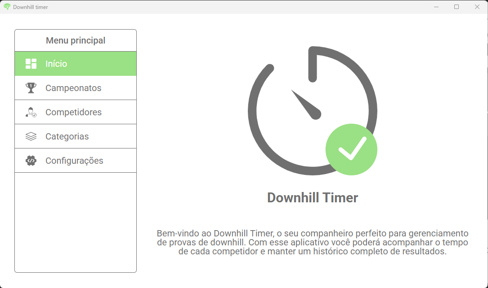

# Downhill timer 🚴⏱️

Este trabalho se propõe a abordar o desenvolvimento de um software inovador dedicado ao gerenciamento de competições de downhill, com o objetivo de aprimorar a organização e otimizar a execução de eventos dessa modalidade do mountain bike.

O principal objetivo deste projeto é desenvolver um software que simplifique o gerenciamento de competições e forneça uma plataforma aberta para integração com sistemas embarcados, permitindo que os desenvolvedores de sistemas embarcados utilizem uma API para estender as funcionalidades do software principal.

A relevância deste projeto reside na sua capacidade de contribuir para a modernização do gerenciamento de provas de downhill, simplificando processos e integrando tecnologias. Ao finalizar este trabalho, espera-se que o software desenvolvido demonstre sua eficácia e que os resultados obtidos possam impactar positivamente a realização de competições dessa modalidade.

[Download](https://github.com/RafaelCecchin/downhill-timer/releases/tag/v1.0.0)

Documentação completa no site do IFPR - Instituto Federal do Paraná | [Acessar documentação](https://ifpr.edu.br/uniao-da-vitoria/wp-content/uploads/sites/27/2024/02/TCC-IFPR-RAFAEL.pdf)

Segue um podcast gerado pelo Google NotebookLM | [Acessar podcast](https://github.com/RafaelCecchin/downhill-timer/blob/master/assets/audio/notebooklm-podcast.wav?raw=true)
